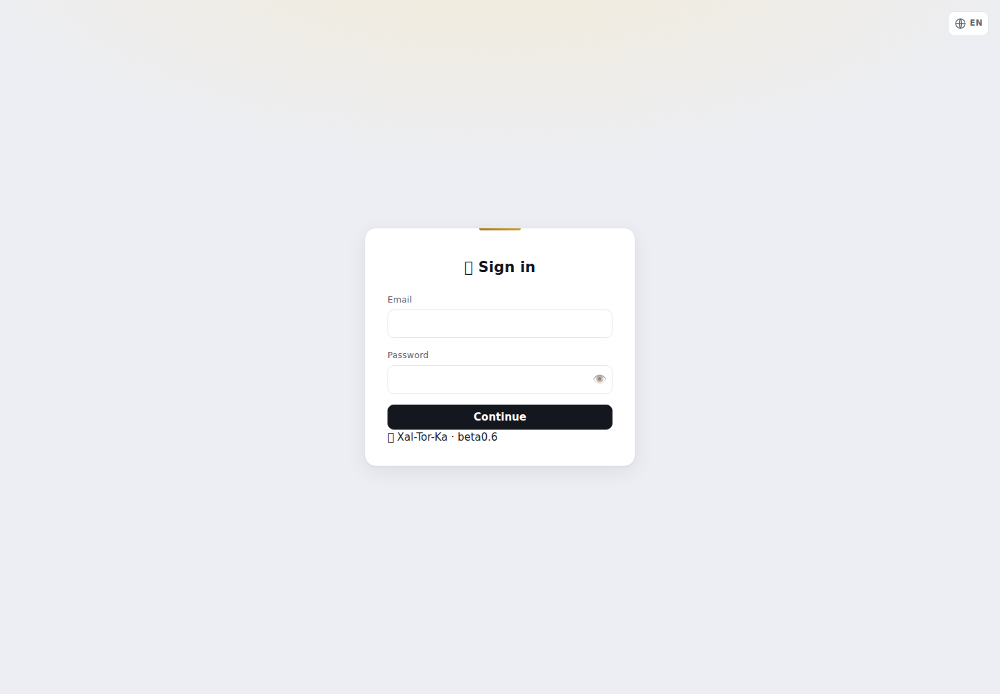
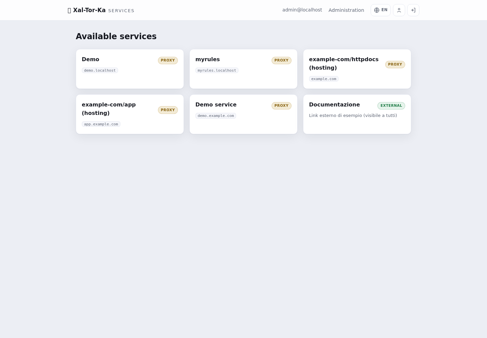
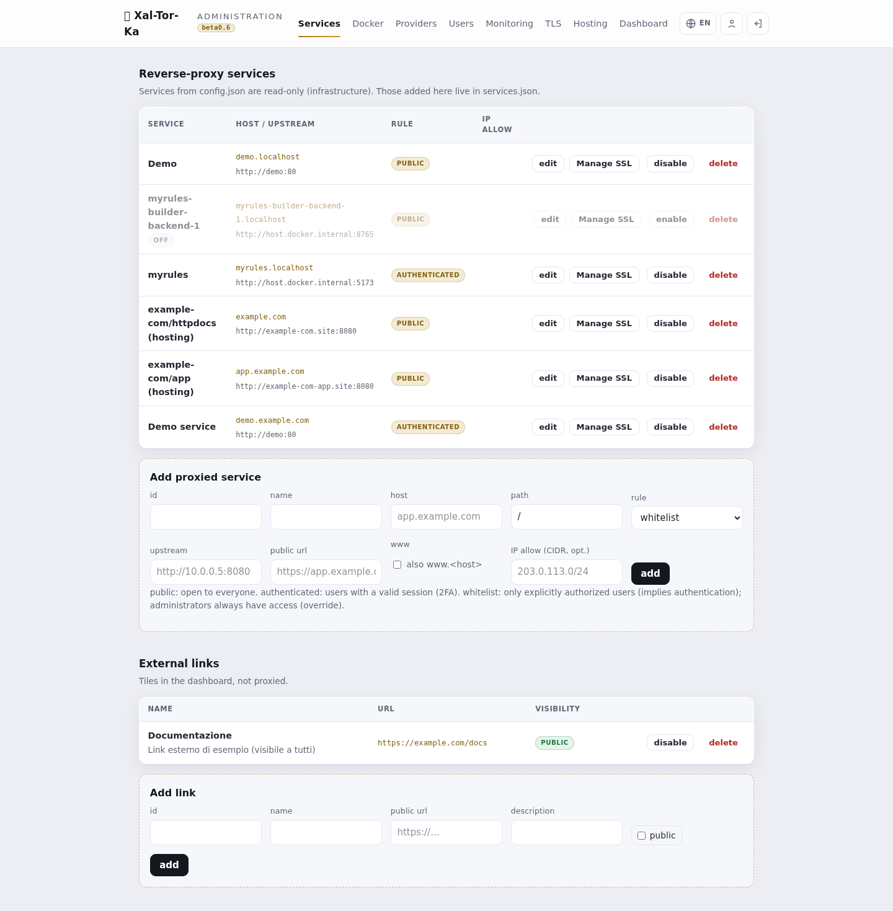
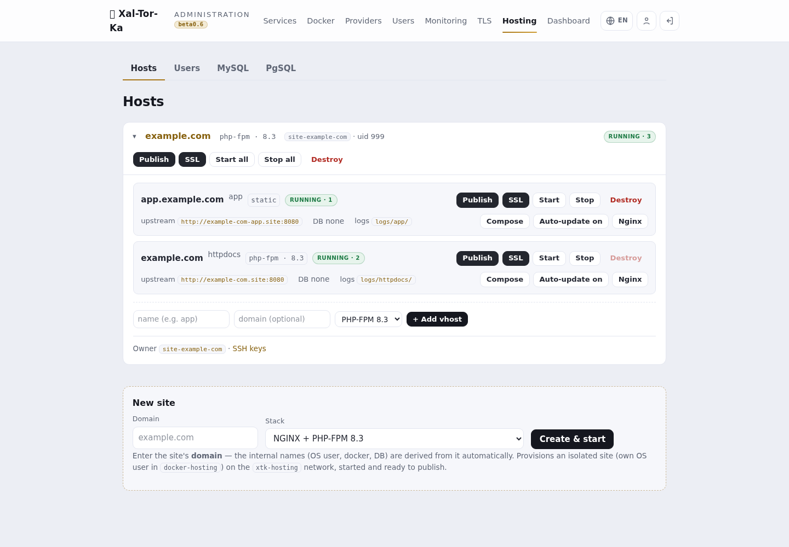
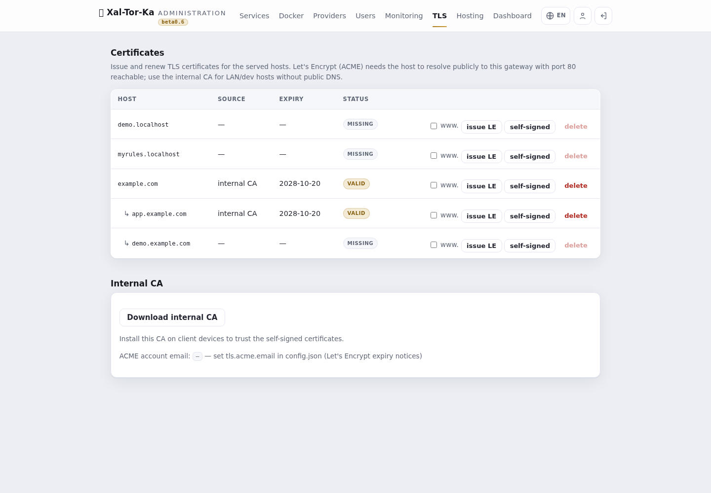
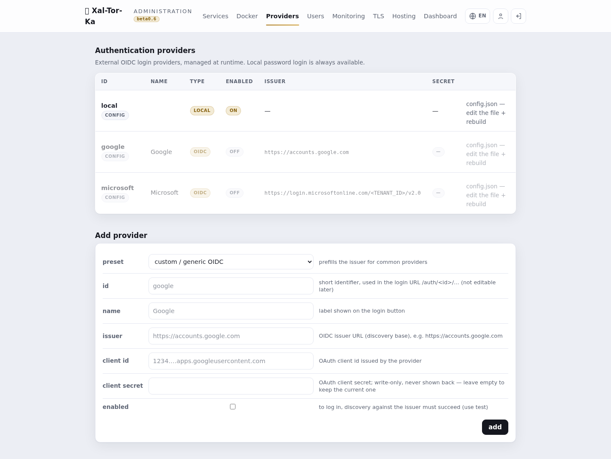
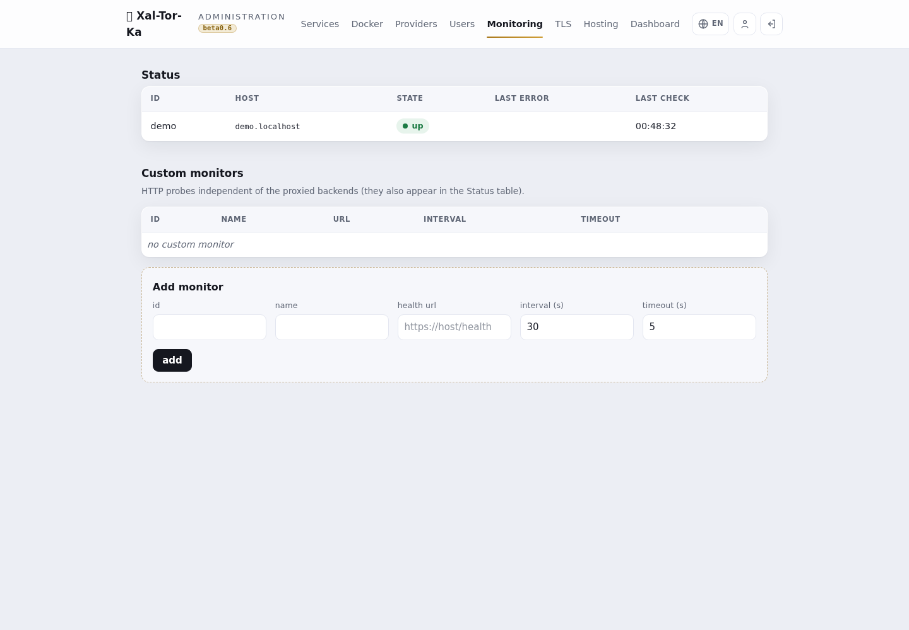

# Xal-Tor-Ka — guida pratica (come si fa)

> Ricettario operativo: le cose che si fanno più spesso, passo-passo. Presuppone un'istanza già
> installata (vedi `INSTALL.md`) e un utente admin. Per il *perché* e il valore vedi
> [`xaltorka-overview.md`](xaltorka-overview.md). Screenshot da installazione dimostrativa.

---

## Accesso
Vai all'URL del gateway e fai login. Gli utenti locali usano email + password (+ codice TOTP se
il 2FA è attivo); in alternativa un pulsante per ogni provider OIDC configurato. L'area di
amministrazione è accessibile solo dagli **IP in whitelist**.

Dopo il login vedi il **catalogo dei servizi** che ti sono visibili. La voce **Administration**
in alto porta al pannello di gestione.

---

## Ricetta 1 — Pubblicare un servizio esistente (reverse-proxy)
Hai già un servizio che gira (un container, un backend interno) e vuoi metterlo dietro il gate.

1. **Administration → Services → Add backend**.
2. Compila:
   - **Host pubblico**: il dominio da cui si accede (es. `app.example.com`).
   - **Upstream**: l'indirizzo interno del servizio (es. `http://mio-servizio:8080`; anche un
     servizio sulla rete Docker interna, non solo sulle reti del computer).
   - **Regola**: `public` (aperto), `authenticated` (richiede login), `whitelist` (solo IP consentiti).
3. Salva. Il backend compare nell'elenco e il routing NGINX si aggiorna.

> Poi dai un certificato all'host (Ricetta 4) e punta il DNS del dominio al gateway.

---

## Ricetta 2 — Creare un sito in hosting (Docker)
Xal-Tor-Ka provisiona un sito isolato da zero: utente di sistema dedicato + Docker, sulla rete
`xtk-hosting`.

1. **Administration → Hosting** → riquadro **New site** in fondo.
2. Inserisci il **dominio** (es. `example.com`) e scegli lo **stack**: NGINX + PHP-FPM
   (8.1/8.2/8.3), con MySQL o PgSQL condiviso, statico, o *custom* (scrivi tu il compose).
3. **Create & start**. Nomi interni (utente OS, container, DB) derivati dal dominio.

Il sito appare come scheda con il suo vhost `httpdocs` già avviato. Da qui gestisci Start/Stop,
Compose, Nginx, e l'accesso.

---

## Ricetta 3 — Aggiungere un sottodominio (vhost) e pubblicarlo
Un sito può avere più vhost (es. `app.`, `api.`), ognuno nella sua Docker.

1. Nella scheda del sito, riga **+ Add vhost**: nome (es. `app`), dominio pubblico opzionale
   (es. `app.example.com`), stack.
2. Il vhost parte con il suo container.
3. **Publish**: apri il dialog del vhost, conferma l'**host pubblico** e la **regola** → crea il
   backend reverse-proxy verso quel vhost.
4. (Poi) **SSL** → emetti il certificato (Ricetta 4).

> Il pulsante **Publish** diventa verde quando il servizio è attivo, rosso se disabilitato, nero
> se non ancora pubblicato. Idem **SSL** per lo stato del certificato.

---

## Ricetta 4 — Emettere un certificato TLS
**Administration → TLS**. La pagina elenca gli **host serviti** (quelli con un backend). I
sottodomini compaiono annidati sotto il dominio padre.

- **issue LE** (Let's Encrypt): per host **pubblici** che risolvono al gateway con la porta 80
  raggiungibile. La spunta **www.** aggiunge anche `www.<host>`.
- **self-signed**: per host **LAN/dev** senza DNS pubblico; usa la **CA interna** (scaricabile
  in fondo alla pagina, da installare sui client per farla fidare).

> Nota: il certificato **segue il backend**. Se un host non compare in TLS, prima pubblicalo
> (Ricetta 1/3). Per l'ACME il container può anche essere spento: la challenge la risponde il gateway.

---

## Ricetta 5 — Aggiungere un provider OIDC (SSO)
**Administration → Providers → Add**.

1. Scegli un **preset** (Google, Microsoft) o *custom*.
2. Compila **id** (mnemonico), **name** (etichetta sul pulsante), **issuer**, **client_id**,
   **client_secret**, e spunta **enabled**.
3. Salva. Comparirà un pulsante di login dedicato nella pagina di accesso.

---

## Ricetta 6 — LDAP / Active Directory
Per autenticare con gli account di dominio: configura la fonte LDAP (bind LDAPS/StartTLS,
template del DN, base DN). Il login locale prova prima le credenziali locali, poi fa fallback su
LDAP — un bind riuscito completa l'autenticazione. Gli account di **Active Directory** funzionano
via bind LDAPS al domain controller (gli account **locali Windows** no: il SAM non è esposto a un
gate Linux). *Dettagli in `docs/next-gen-auth-sources.md`.*

---

## Ricetta 7 — Database condivisi e Adminer
Negli stack hosting puoi attaccare un **MySQL** o **PgSQL condiviso**: le tab **MySQL**/**PgSQL**
in Hosting gestiscono le istanze condivise; a ogni sito che lo richiede viene assegnato un DB con
utente isolato (nomi/credenziali generati). Un **Adminer** effimero permette di ispezionare i DB.

---

## Ricetta 8 — Accesso SFTP/SSH al sito
Ogni sito ha un utente di sistema con **chroot** per SFTP/SCP (porta dedicata). Dalla scheda del
sito → **SSH keys** (o **Owner**): genera/gestisci le **chiavi pubbliche** dell'utente (usabili al
posto della password), con download del file combo. Le chiavi si incollano/modificano dal pannello.

---

## Ricetta 9 — Blindare l'admin e le notifiche remote
- **Whitelist IP admin**: imposta gli IP/CIDR autorizzati all'area di amministrazione (il tuo IP
  pubblico/VPN in produzione). Tutto il resto resta fuori dall'admin.
- **Notifiche/controllo remoto** (opzionale): configura un bot **Telegram** e/o **SMTP/IMAP** per
  ricevere log di sistema a distanza e mandare **comandi vettati** (allow-list mittenti + comandi;
  email firmate DKIM). Utile come log-system remoto e per operazioni base senza aprire il pannello.

---

## Ricetta 10 — Proteggere path specifici (auth per-path)
Un sito può restare **pubblico** ma con singoli path/file dietro autenticazione — es. mettere
`wp-login.php` e `/wp-admin/` dietro login (o Google), lasciando il resto aperto. Difesa in
profondità: i bot non raggiungono nemmeno la pagina di login.

1. **Administration → Services → Modifica** il servizio.
2. Nella sezione **Regole per path** aggiungi righe: **path** + **match** (`esatto =` per un file,
   `prefisso` per una cartella) + **regola** (`authenticated`/`whitelist`).
3. Salva. Il resto di `/` mantiene la regola principale; la riga più specifica vince. Funziona
   anche per i siti in hosting (l'upstream resta quello gestito).

---

## Ricetta 11 — Difesa dai brute-force (fail2ban)
Il gate scrive un log dei fallimenti di autenticazione; un jail fail2ban banna al **firewall** gli
IP che insistono. Difesa a strati: rate-limit in RAM nel gate + ban dell'IP.

- Attivato il jail, in **Administration → Hosting → System**, il pannello **Firewall — fail2ban**
  mostra gli **IP bannati** e permette lo **Unban** dall'admin, senza SSH.
- I ban colpiscono solo le porte web (80/443), **mai SSH**; gli **IP admin e la LAN sono in
  whitelist** (anti-lockout). Il ban avviene in *prerouting* nftables, così è efficace anche col
  gate in container.

---

## Ricetta 12 — Aggiornamenti del sistema operativo
**Administration → Hosting → System** elenca gli aggiornamenti OS disponibili sull'host (controllo
**read-only** via l'agente vettato).

1. Seleziona i pacchetti (o *Select security*) e **Apply selected** — l'applicazione è admin-gated e
   **non riavvia mai** da sola.
2. **Hold** blocca un pacchetto a una versione (no-update); **Release** lo sblocca.

---

## Riferimento rapido
| Voglio… | Vai a |
|---|---|
| Mettere auth/HTTPS davanti a un servizio | Services → Add backend, poi TLS |
| Creare un sito nuovo | Hosting → New site |
| Aggiungere un sottodominio | Hosting → scheda sito → + Add vhost → Publish |
| Un certificato | TLS → issue LE / self-signed |
| SSO aziendale | Providers (OIDC) / config LDAP |
| Accesso ai file del sito | Hosting → scheda sito → SSH keys (SFTP) |
| Chi può entrare nell'admin | Whitelist IP admin |
| Proteggere wp-login/una cartella | Services → Modifica → Regole per path |
| Bloccare i brute-force | fail2ban (jail) → Hosting → System (IP bannati/Unban) |
| Aggiornare l'OS dell'host | Hosting → System → Apply selected |

---

*Xal-Tor-Ka è software di SFS.it. Screenshot da installazione dimostrativa con dati di esempio.*
